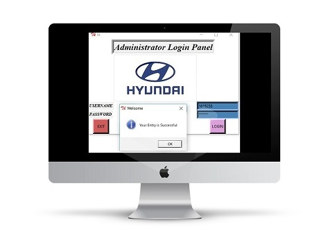

# Car-Booking-System
A car booking system made using python 2.17-tkinter GUI and sqlite3 database. 
Link for the Project is:-https://tripathi2212.github.io/Car-Booking-System/my pro.py

**Administrator Login Panel**
Username:-161B258 (Case Sensitive),
Password:-python

**Login with Confirmation Message**

**Home**

**Home/SUV**

**Home/SEDAN**

**Home/HATCHBACK**

**Booking Page**

**Booking Field**
(Minimum booking value will be >=51000 otherwise it will show error through Error Message Box)

**Booking Confirmation**

**Booking List from the Database**

